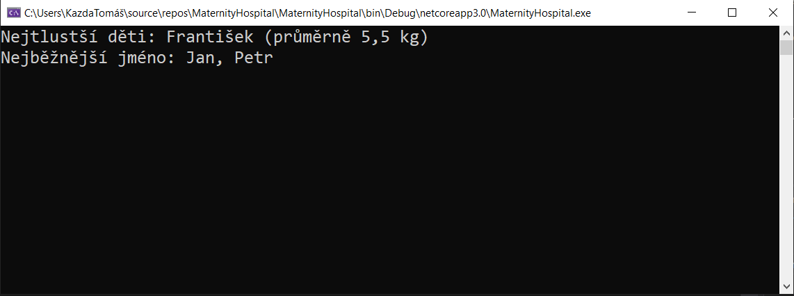

# Praktikum (kolekce, cykly) C# - *Maternity Hospital*

Vytvořte aplikaci, která umožní sledovat statistiky četností křestních jmen a průměrných hmotností narozených dětí v porodnici **„Statistik & syn“**.
Zajímá nás počet výskytů jednotlivých křestních jmen ve sledovaném období – aplikace vypíše seznam nejčastěji udělovaných jmen.
Dále sledujeme průměrnou hmotnost (aritmetický průměr) dětí stejného křestního jména. Aplikace vypíše seznam jmen s průměrně největší hmotností ve srovnání s ostatními dětmi – dozvíme se tak, která jména jsou pravděpodobně spojena s novorozeneckou obezitou ;-)

*Kromě funkčnosti se hodnotí objektová implementace, čistota syntaktického zápisu, vhodné značení metod, proměnných, vlastností a atributů, efektivita kódu a smysluplnost použitých proměnných.*

  

## Testovací sada dat:
Ukázka výstupu aplikace (obrázek výše) byla naplněna postupně těmito údaji:

| jméno | hmotnost |
|--|--|
| František | 3 kg; 8 kg |
| Jan| 3,5 kg; 4 kg; 5 kg |
| Petr| 4 kg; 5 kg; 6 kg |

    mhs1.AddChild("František", 3);
    mhs1.AddChild("Jan", 4);
    mhs1.AddChild("Petr", 5);
    mhs1.AddChild("Jan", 5);
    mhs1.AddChild("Petr", 6);
    mhs1.AddChild("Petr", 4);
    mhs1.AddChild("František", 8);
    mhs1.AddChild("Jan", 3.5);

## Poznámky k realizaci (*+-požadavky*)
* Vstupem je jméno právě narozeného dítěte a jeho hmotnost v kilogramech
*  Algoritmus navrhněte tak, aby reflektoval i situaci, kdy bude **více než jedno** nejčastější jméno. Například v ukázce je František 2×, Petr 3× a Jan 3× – proto ve výpise je jak Jan, tak Petr
* Hmotnost je vztažena k jednotlivým křestním jménům a jedná se o **aritmetický průměr!** Například v ukázce **žádný z Františků neváží 5 kg** – jeden má hmotnost 3 kg, druhý 8 kg. Hmotnost 5,5 kg je aritmetickým průměrem jejich hmotností.
* Můžete pracovat s metodami jmenných prostorů `using System.Collections.Generic;` a `using System.Linq;`
* K návrhu použijte třídu `abstract class BaseMHStats`

		abstract class BaseMHStats
		{
			public abstract void AddChild(string name, double weight);
			public abstract string GetCommonNames();
			public abstract double GetFatWeight();
			public abstract string GetFatNames();
		}

## Doporučené uspořádání dat
Data uchovávejte v objektech / strukturách tak vhodně, jak to vaše vědomí a svědomí dovolí.
Nejvhodnější uspořádání je Dictionary, kde klíčem je řetězec (jméno dítěte) a hodnotou objekt se jménem, průmrnou hmotností a počtem opakování jména - `Dictionary<string, ObjektSeStatistikami>`.
Alternativou je to samé v Listu - `List<ObjektSeStatistikami>`, ale zde bude složitější přidávání položek.
Poslední (už méně) rozumnou možností jsou dva slovníky - Dictionary se statistikou jmen a Dictionary se statistikou hmotností...
